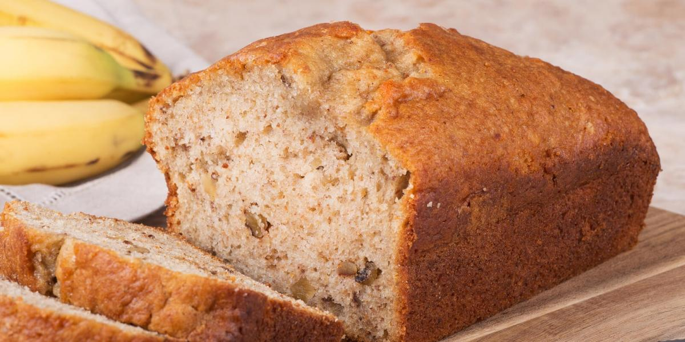

## BANANA NUT BREAD

### Ingredients:

- 3 C. all purpose flour  
- 3 eggs. 

- 3/4 tsp. salt   

- 1 C. oil. 

- 1 tsp. baking soda 

- 2 C. mashed ripe bananas. 

- 1 tsp. cinnamon  

- 1 (8 oz.) can crushed pineapple   

- 1/2 to 1 C. chopped walnuts  

- 2 tsp. vanilla. 
- 2 C. sugar

### Instructions:

In large mixing bowl, sift flour, salt, baking soda, & cinnamon together. Add nuts & mix well. In a separate bowl, combine sugar, eggs, oil, mashed bananas, crushed pineapple, & vanilla. Blend together well. Stir sugar-egg mixture into flour mixture, mixing until moistened. Bake 60-70 minutes 350 degrees.   
Makes 2 loaves or 12 muffins 

#### CREDITS:

Monta "Go" Walker

