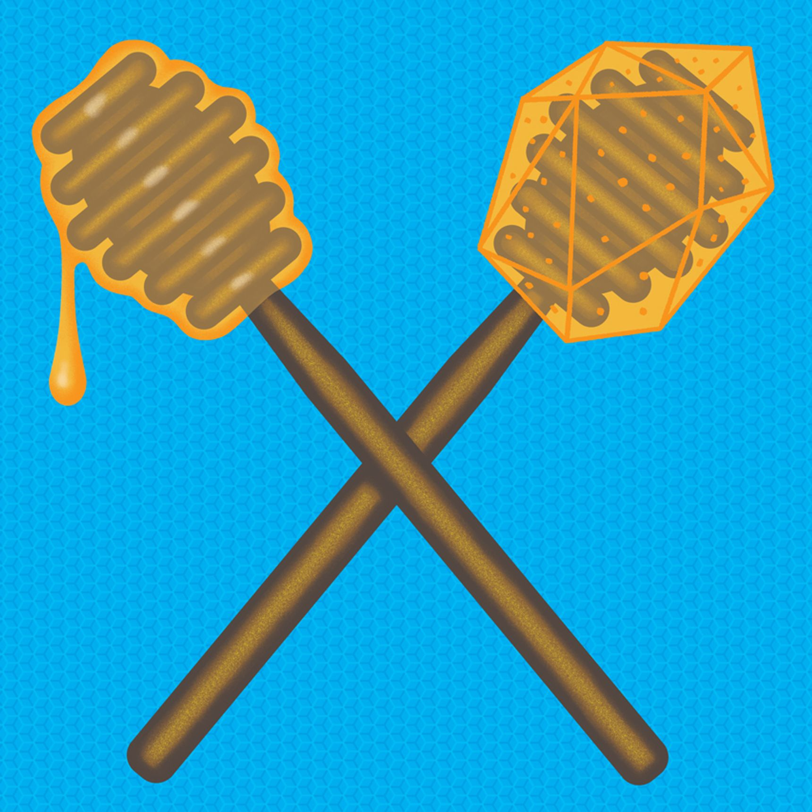

# The Surprising Crystals Hiding in Honey

#### *Physicist Helen Czerski explores the science in honey: Bees work hard to make honey a stable liquid, but sometimes it crystallizes into a solid in our kitchen cabinets. Here’s why. By Physicist Helen Czerski, [published in WSJ, Jan 27, 2022](https://www.wsj.com/articles/the-surprising-crystals-hiding-in-honey-11643313927?page=1).*

Honey is one of the great delights of the natural world: an ingenious food storage system for bees and an occasional treat for bears, humans and any other animals with a sweet tooth and a resistance to bee stings. Honey is normally a liquid at room temperature, and any child or advertising campaign will emphasize that feature—honey is runny. But when a recipe required me to retrieve a jar from the back of my cupboard this week, I found that the honey had crystallized and was mostly solid. It wasn’t old or spoiled, just solid. Did that matter?

The honey we eat starts off as nectar made by flowering plants as a sugary treat to attract bees for pollination. The exact composition depends on which plants the nectar came from, but the type of sugar in it is almost all sucrose, a compound made by pairing one glucose molecule and one fructose molecule.

The bees need to store some of their sugary bounty in the hive, so they process it to make it more suitable for storage. They remove water from it by an elaborate mechanism and split the sucrose into its component parts, ending up with a mixture of around 38% fructose, 32% glucose and 17% water, depending on the source of the nectar, with other molecules making up the rest. At that ratio, there’s too little water it in for microbes to grow but enough that it’s viscous and easily sealed into honeycomb compartments.

So where do the crystals come from? In a typical honey, so much glucose is dissolved in the solution that it becomes supersaturated, spurring glucose molecules to separate from the liquid and form crystals given the slightest chance. (The fructose is easier to keep in dissolved form.) Each crystal just needs a starting point, such as a grain of pollen or a speck of beeswax. Though commercial honey is filtered to remove these tiny intruders, if left for long enough some of the glucose molecules will find something, even air bubbles, to act as a foundation. 

Types of honey with higher ratios of glucose are more likely to form crystals. The temperature also matters: Below 39 degrees Fahrenheit, the glucose molecules have relatively little energy and can’t move around easily; at 77 degrees and above, it becomes easier for the molecules to remain in solution. But crystals can form between those temperatures, most easily around in the middle at roughly 60 degrees (so don’t store your honey in the garage). At first the crystals tend to sink, leaving you with honey that’s solid at the bottom of the jar and liquid at the top.

After many months, crystallization may continue and spread through the jar, or enough glucose may have solidified into crystals to form a balance in the rest of the honey. Meanwhile, the rest of the honey now has a higher proportion of water: Each dissolved glucose molecule is surrounded by a cluster of five water molecules, but when it becomes part of a crystal it gives up four of its molecular groupies, leaving more water free. If that process carries on and if the honey is also left uncapped and exposed to air so it can absorb even more water, the liquid honey may become dilute enough for specialized yeasts in the honey to start to grow and cause spoilage. That’s exactly what the bees worked to avoid.

### ***Fortunately, there’s an easy way to get rid of the crystals and restore balance: Immerse the jar in hot water (around 120 degrees) for a few minutes, and the solid glucose crystals will redissolve, taking the honey back to its original state.***

So I spooned some crystallized honey into my cooking without worrying—it’s safe and tastes the same—and warmed up the rest to re-liquify it. I don’t mind the crystals. They’re a reminder of the molecular secrets that honey is hiding inside itself. 

